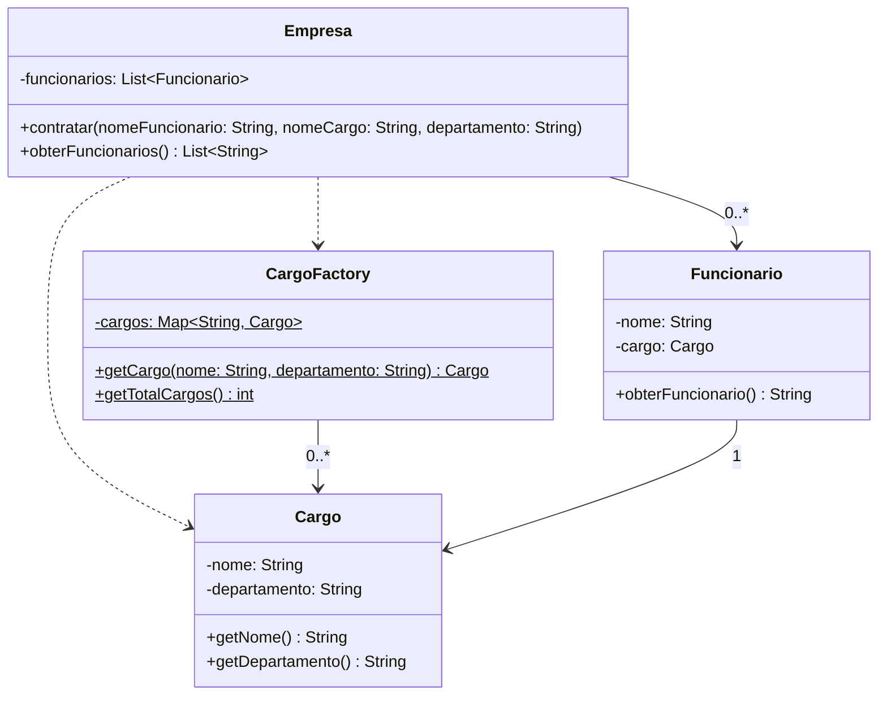

# Diagrama UML — Flyweight (Funcionários e Cargos)

```mermaid
classDiagram
    class Empresa {
        -funcionarios: List~Funcionario~
        +contratar(nomeFuncionario: String, nomeCargo: String, departamento: String)
        +obterFuncionarios() List~String~
    }

    class CargoFactory {
        -cargos: Map~String, Cargo~$
        +getCargo(nome: String, departamento: String)$ Cargo
        +getTotalCargos()$ int
    }

    class Funcionario {
        -nome: String
        -cargo: Cargo
        +obterFuncionario() String
    }

    class Cargo {
        -nome: String
        -departamento: String
        +getNome() String
        +getDepartamento() String
    }

    Empresa --> Funcionario : 0..*
    Empresa ..> CargoFactory
    Empresa ..> Cargo
    CargoFactory --> Cargo : 0..*
    Funcionario --> Cargo : 1
```
